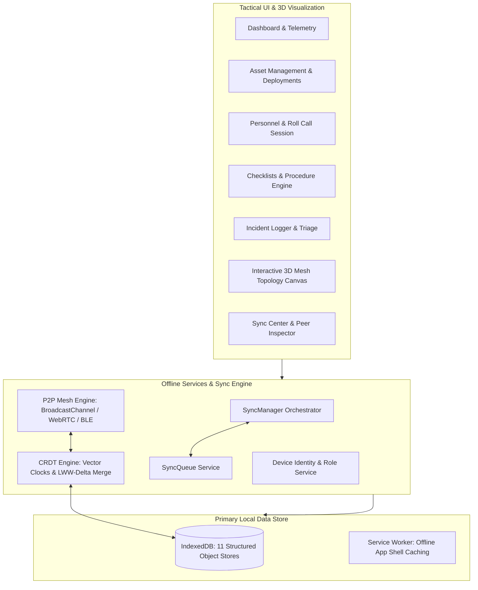

# FIELDLINK // Zero-Bandwidth Tactical Asset & Checklist Sync via Mesh Networking

[](https://reactjs.org/)
[](https://www.typescriptlang.org/)
[](https://threejs.org/)
[](https://web.dev/progressive-web-apps/)
[](https://developer.mozilla.org/en-US/docs/Web/API/IndexedDB_API)

Field units, disaster-relief crews, and cadet contingents often operate in hostile or remote areas with **zero cellular/internet connectivity**. 

**FIELDLINK** is an offline-first Progressive Web Application (PWA) that allows field operators to manage tactical equipment, conduct live squad roll calls, execute mission checklists, and log SITREP incidents completely offline — synchronizing peer-to-peer across nearby devices using **Mesh Networking (WebRTC DataChannels + BroadcastChannel mesh) and CRDT-based deterministic delta merging**.

---

## 🎯 Key Features & Modules

### 1. 🎛️ Tactical Operations Dashboard & Telemetry
- **Field Picture Overview**: Real-time readiness gauge, active asset accountability, squad roll-call ratios, and pending synchronization telemetry.
- **Embedded 3D Mesh Topology**: Interactive Three.js canvas displaying connected nodes, packet transfers, floor radar rings, and peer link signals.

### 2. 📦 Asset Accountability & Field Deployments
- Full CRUD for tactical equipment (Medical trauma kits, Satellite radios, Recon drones, Solar power packs).
- Filter by Category, Condition (Operational, Good, Degraded, Critical), and Status (Available, Deployed, Maintenance).
- Assign gear to operators and operational sectors with audit trails.

### 3. 👥 Personnel & Tactical Roll Call
- Squad roster management with ranks, callsigns, roles, and unit assignments.
- **Interactive Roll Call Session**: 1-tap rapid status toggling (`Present`, `Absent`, `Missing`, `Injured`), live summary metrics (`18/20 accounted`), and operator signature stamps.

### 4. 📋 Operational Checklists
- Pre-configured & custom tactical checklists (*Comms & Navigation Check*, *Deployment Preparation*, *Emergency Response Protocol*).
- Step-by-step verification with grow-only CRDT accumulation and operator verification badges.

### 5. ⚠️ Incident Reporting & SITREP Logger
- Offline emergency SITREP logging: Type (Medical, Equipment Failure, Comms Blackout, Perimeter Alert, Hazard), Severity matrix (Critical, High, Medium, Low), GPS coordinates, and linked assets/personnel.

### 6. 🌐 3D Peer-to-Peer Mesh & CRDT Synchronization Engine
- **3D Mesh Visualizer**: Interactive Three.js rendering of field nodes with animated 3D packet spheres traversing links in real time during sync events.
- **Deterministic CRDTs**:
  - **LWW (Last-Write-Wins)** with Lamport clocks, wall-clock timestamps, and deterministic Device ID tiebreaking.
  - **Multi-Entry Set CRDT** for roll call rosters.
  - **Grow-Only Checklist CRDT** for multi-operator task completion without race conditions.
- **P2P Transports**: Multi-tab `BroadcastChannel` local mesh, WebRTC DataChannels with QR/SDP manual signaling, and Web Bluetooth (BLE) abstraction layer.

### 7. 🧪 Built-In Automated Verification Suite & Demo Simulator
- **Multi-Node Simulator**: 1-click toggle between Node A-17 (North Node), Node B-04 (Delta Patrol), and Command Hub R-01.
- **Automated Hackathon Demo Walkthrough**: Simulates offline asset update on Node A -> offline incident on Node B -> proximity discovery -> 3D mesh sync -> CRDT merge -> celebratory confetti!
- **In-App CRDT Verification Suite**: Validates IndexedDB transactions, vector clock ordering, deterministic LWW conflict resolution, and duplicate packet suppression.

---

## 🏗️ Architecture Overview



---

## 🚀 Quick Start

### Prerequisites
- Node.js 18+
- npm / yarn / pnpm

### Installation

```bash
# Clone the repository
git clone https://github.com/bhushzn/Offline-Mesh-Asset-Sync.git
cd Offline-Mesh-Asset-Sync

# Install dependencies
npm install

# Start local development server
npm run dev
```

Open your browser at `http://localhost:5173`.

### Production Build

```bash
npm run build
npm run preview
```

---

## 🛡️ License

MIT License. Designed for tactical field operations, disaster relief contingents, and zero-connectivity resilience.
