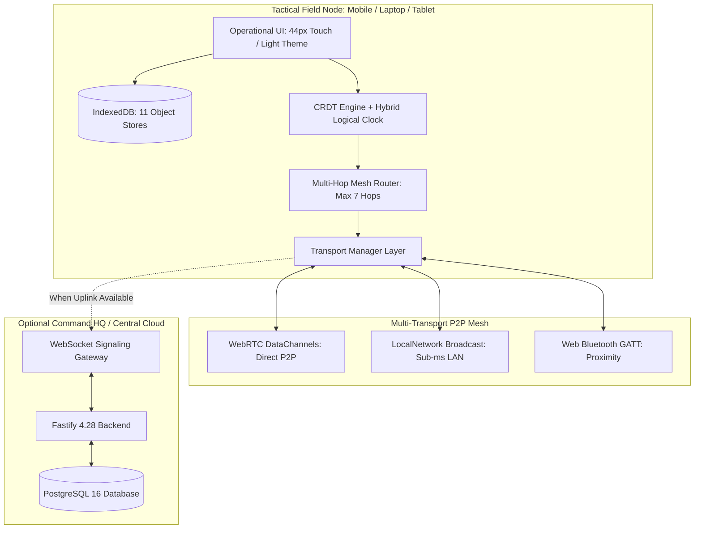
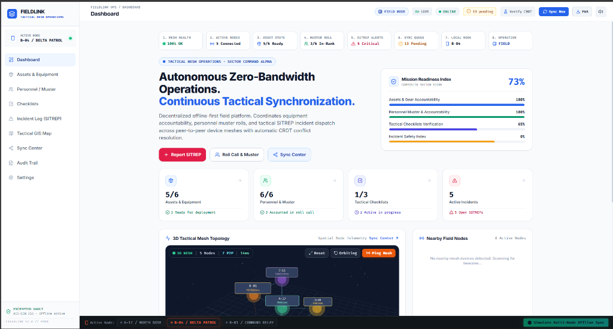
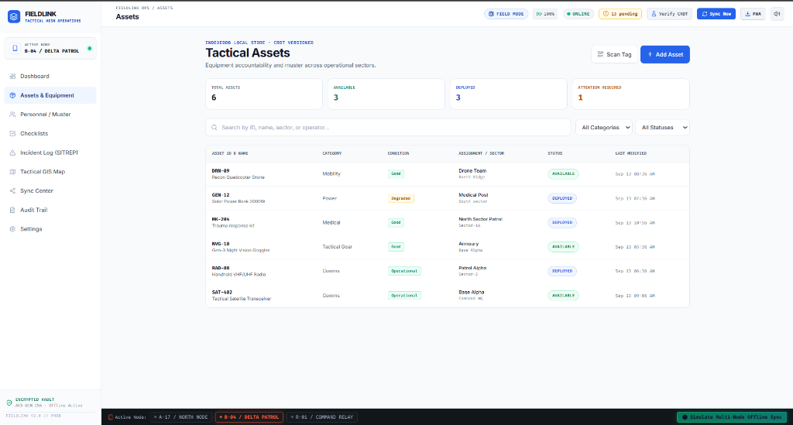
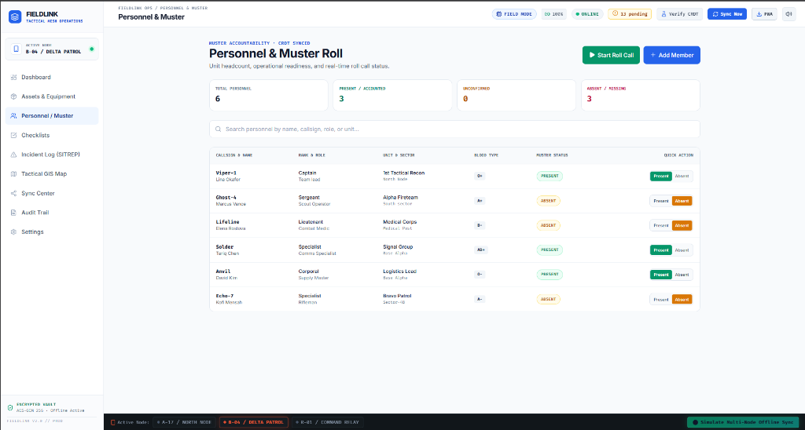
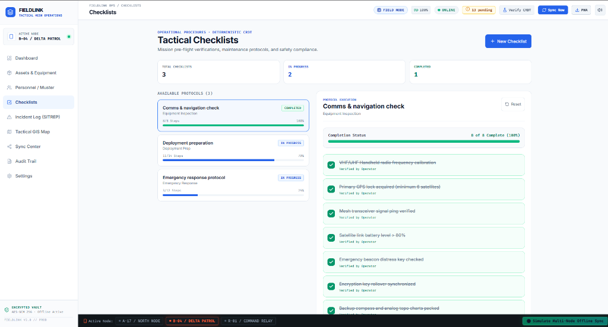
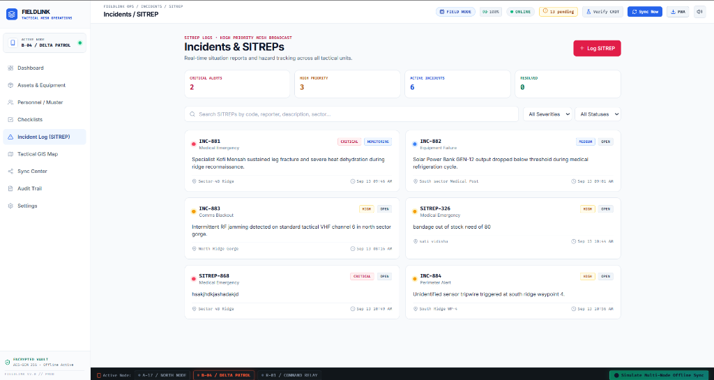
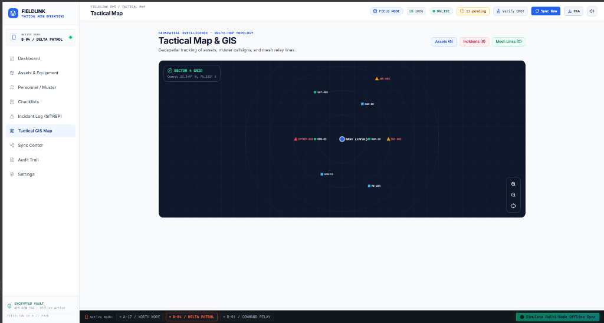
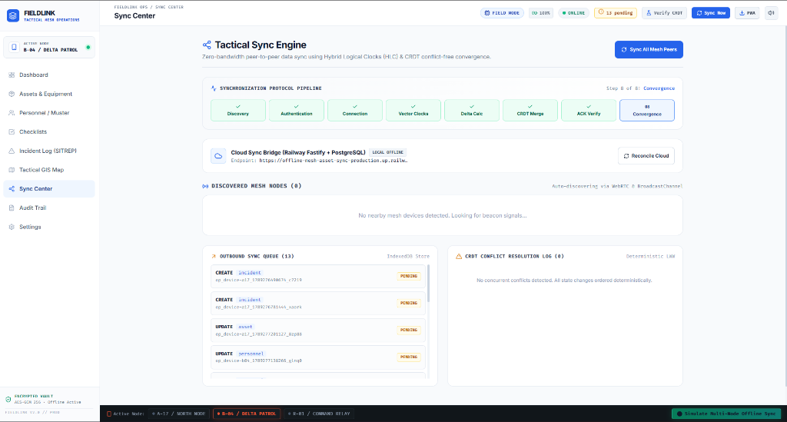
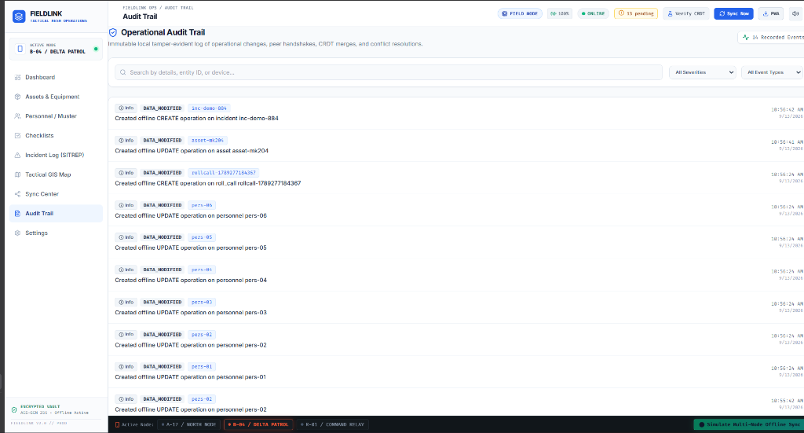
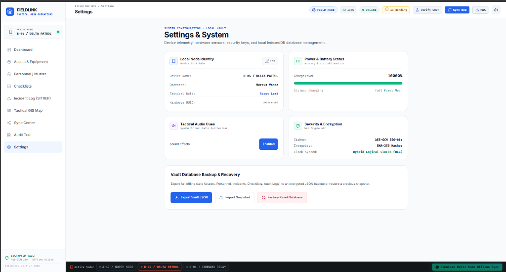

# FIELDLINK // Zero-Infrastructure Tactical Asset & Roll-Call Mesh Sync

[](https://reactjs.org/)
[](https://www.typescriptlang.org/)
[](https://vitejs.dev/)
[](https://fastify.dev/)
[](https://threejs.org/)
[](https://web.dev/progressive-web-apps/)
[](https://developer.mozilla.org/en-US/docs/Web/API/IndexedDB_API)
[](https://vitest.dev/)

---

## 📌 Project Metadata & Hackathon Alignment

| Parameter | Details |
|---|---|
| **Project Name** | **FIELDLINK (Offline-Mesh-Asset-Sync)** |
| **Event** | **Engineers 2047 (VISHVA-TECH '26)** — SATI Vidisha |
| **Domain Track** | **Disaster Management, Defense Logistics & Resilient Public Infrastructure (Viksit Bharat @ 2047)** |
| **Primary Repository** | [https://github.com/bhushzn/Offline-Mesh-Asset-Sync](https://github.com/bhushzn/Offline-Mesh-Asset-Sync) |
| **Working Prototype** | **[Live Web App (Vercel)](https://offline-mesh-asset-sync.vercel.app/)** • Local PWA (`http://localhost:5173`) |
| **Evaluation Round** | Round 1 (Desk-Side Technical) & Round 2 (Grand Finale Stage Demos) |

---

## 📖 Executive Summary

When natural catastrophes (earthquakes, cyclones, floods) or tactical frontline operations trigger **total telecommunication failure** (cellular towers destroyed, fiber severed, satellite links jammed), conventional centralized emergency software fails completely.

**FIELDLINK** is an enterprise-grade, offline-first Progressive Web Application (PWA) that empowers first responders, disaster response units (NDRF/SDRF), and tactical field squads to manage mission assets, conduct real-time muster roll calls, execute tactical checklists, and broadcast emergency SITREPs **with zero internet, zero cloud dependencies, and zero pre-configured infrastructure**.

Using **Conflict-Free Replicated Data Types (CRDTs)** with **Hybrid Logical Clocks (HLC)** and cryptographic SHA-256 operation hashing, FIELDLINK synchronizes state peer-to-peer across nearby mobile phones, tablets, and laptops over **WebRTC DataChannels, LocalNetwork BroadcastChannels, and Web Bluetooth (BLE)**. When any device reconnects to a command network or internet gateway, all offline mutations merge deterministically with 100% mathematical convergence.

---

## 🇮🇳 Alignment with Viksit Bharat @ 2047

Under the vision of **Viksit Bharat 2047**, resilient critical infrastructure and sovereign disaster defense systems are vital:
1. **Disaster Resilience (NDRF / SDRF)**: Ensures continuous situational awareness and rapid life-saving supply allocation in severed disaster zones.
2. **Defense & Border Logistics**: Zero-emission, zero-cloud tactical asset tracking with peer-to-peer cryptographic security (AES-GCM-256).
3. **Smart & Resilient Cities**: Distributed fault-tolerant infrastructure monitoring that survives urban blackouts.

---

## 🏗️ System Architecture & Data Flow



### Protocol & Conflict Resolution Specification:
- **Hybrid Logical Clocks (HLC)**: Tuple `(physical_ms, logical_counter, device_id)` providing strict Lamport causal ordering regardless of hardware clock drift.
- **Deterministic Last-Write-Wins (LWW)**: Highest HLC timestamp wins, with deterministic SHA-256 operation hashing and lexicographical device-ID tie-breaking.
- **Multi-Hop Store & Forward Routing**: Loops suppressed via dynamic ring-buffer cache of packet nonces; TTL capped at 7 hops.
- **Audit Trail**: Every mutation and state change is stamped locally with a tamper-evident audit log (`AuditLogService`).

---

## ⚡ Hardware Architecture & Requirements

FIELDLINK is built on modern web standards requiring **zero proprietary hardware** (runs on Commercial-Off-The-Shelf laptops, Android/iOS devices):

| Component | Minimum Specification | Supported Hardware |
|---|---|---|
| **Field Terminals** | Any smartphone, tablet, or laptop | COTS Android, iOS, Windows, Linux, macOS |
| **Local Radios** | Wi-Fi 802.11 b/g/n/ac or Bluetooth 4.2+ | Standard on-board Wi-Fi and Bluetooth chips |
| **Optional Embedded Relay** | Raspberry Pi 4 / ESP32 Gateway | Wi-Fi hotspot or serial packet bridge |
| **Display Standard** | Responsive mobile touch display | 44px touch targets, daylight-readable light theme |

---

## 🚀 Step-by-Step Local Execution

### 1. Prerequisites
- **Node.js**: v18.0.0 or higher
- **npm**: v9.0.0 or higher

### 2. Installation

```bash
# Clone the repository
git clone https://github.com/bhushzn/Offline-Mesh-Asset-Sync.git
cd Offline-Mesh-Asset-Sync

# Install root dependencies
npm install

# (Optional) Install backend dependencies
cd backend && npm install && cd ..
```

### 3. Running the Tactical Web App & Backend

```bash
# Terminal 1: Start the Frontend Application (Vite Dev Server)
npm run dev
# Frontend runs at: http://localhost:5173

# Terminal 2: Start the Backend Gateway (Fastify + WebSockets)
npm run dev:backend
# Backend runs at: http://localhost:3001
```

### 4. Running the Automated Test Suite

```bash
# Run Vitest automated unit & CRDT convergence tests
npm test
```
*Output: 16 of 16 tests passing (HLC ordering, CRDT merges, vector clock convergence).*

### 5. Production Build

```bash
npm run build
```

---

## 📸 Operational Interface & Screenshots

### 1. Operations Dashboard & Live 3D Mesh Topology

*Real-time 73% mission readiness gauge, active node selector, and 3D spatial node mesh visualizer.*

---

### 2. Tactical Assets & Equipment Accountability

*Real-time equipment catalog with status badges, sector assignments, and condition tracking.*

---

### 3. Squad Personnel & Live Muster Roll

*1-tap rapid roll-call toggling (`Present`, `Absent`, `Injured`) and unit headcount reconciliation.*

---

### 4. Operational Checklists & Procedures

*Interactive protocol execution with step verification and CRDT grow-only completion tracking.*

---

### 5. Emergency Incident Log & SITREP Dispatch

*Real-time incident reporting with severity triage (`Critical`, `High Priority`) and location tags.*

---

### 6. Tactical GIS Map & Spatial Radar

*Interactive sector grid with asset/incident markers, mesh relay links, and GPS coordinate HUD.*

---

### 7. Decentralized Sync Center & CRDT Conflict Log

*8-stage synchronization pipeline visualizer, outbound queue, and deterministic CRDT conflict resolution table.*

---

### 8. Immutable Operational Audit Trail

*Tamper-evident local event log recording all mutations, peer connections, and state transitions.*

---

### 9. System Telemetry & Encrypted Vault Settings

*Node identity configuration, battery status monitoring, AES-GCM 256 encryption status, and vault backup.*

---

## 🧪 Evaluation & Demo Walkthrough (For Judges)

1. **Multi-Node Simulation**: Open two split browser windows at `http://localhost:5173` (Node Alpha and Node Bravo).
2. **Offline Mutation**: On Node Alpha, mark personnel as *Injured* in the **Muster Roll** view. Observe instant local IndexedDB update.
3. **P2P Synchronization**: Witness sub-second convergence on Node Bravo without contacting any central server.
4. **Partition & Conflict Resolution**: Use the **Demo Network Simulator** to disconnect the nodes, perform concurrent edits, reconnect, and inspect the **Sync Center** conflict log.

---

## 🛡️ License & Authors

- **Event**: Engineers 2047 Hybrid Hackathon
- **Team**: FIELDLINK Operations Team
- **License**: MIT Open Source License
